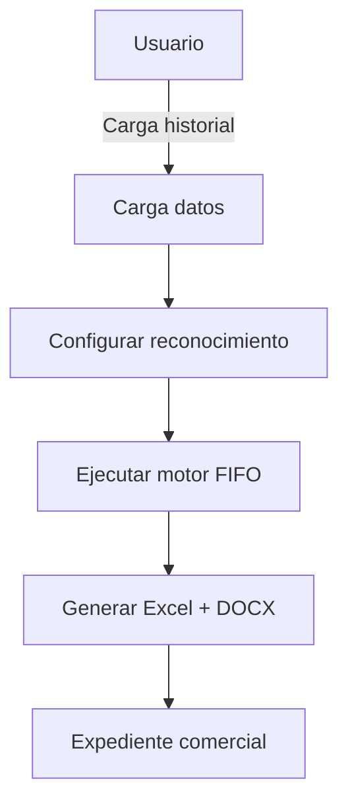

# G360 Sustento Multirreferencia 🚀

> Microherramienta avanzada del ecosistema G360 para la automatización de cuadros de sustento — Notas de Crédito (NC), Débito (NDB), Factura Directa — y análisis de ventas CRM.

[](https://opensource.org/licenses/MIT)
[](https://github.com/carloscus/g360_NC_sustentor.git)
[](https://www.python.org/downloads/)
[]()



## Tabla de Contenidos

- [Características](#características)
- [Instalación](#instalación)
- [Uso Básico](#uso-básico)
- [Reportes Disponibles](#reportes-disponibles)
- [Diccionario de Datos](#diccionario-de-datos)
- [Decisiones de Diseño Importantes](#decisiones-de-diseño-importantes)
- [Estructura del Proyecto](#estructura-del-proyecto)
- [Desarrollo](#desarrollo)

---

## 🚀 Características

### 🧠 Tipos de Reconocimiento
- **Diferencia de Precio**: Compara precio facturado vs. lista de precios vigente.
- **Omisión de Descuentos**: Aplica cadena de descuentos autorizada.
- **Bonificación 12+1**: Calcula unidades bonificadas por mecánica promocional.
- **Rebate por Meta**: Aplica % de rebate sobre compras acumuladas en período.
- **Anulación de Factura**: Reporte con columnas editables (P.BASE, DESC_1, DESC_2) y fórmulas vivas.
- **Feria / Preventa**: Cruce entre solicitud y facturación real.
- **Sustento por Factura**: Verificación de precios contra condición comercial.
- **Descuento en Factura**: % global o por SKU con archivo de filtro.

### 📊 Reportes Generados
- **Excel (NC)**: Cabecera + detalle de SKU con fórmulas, alertas y validaciones.
- **DOCX (Informe)**: Informe de sustento comercial programático con header/footer profesional.
- **Plantillas**: Descarga de templates para Historial, Requerimientos y SKU.

### Validación de Datos
- **Detección de NC/NDB**: Identifica notas existentes en el historial para evitar sobre-sustentar.
- **Validación de campos críticos**: ID_ARTICULO, NOM_ARTICULO, FECHA_ORIG, CANTIDAD, SOLES, TPO_DOC, SERIE_DOC, NRO_DOC.
- **Normalización**: Limpieza y estandarización de datos ERP.

---

## 📦 Instalación

### Requisitos
- Python 3.11+

### Instalación
```bash
# Sincronizar dependencias con UV
uv sync

# Ejecutar
python main.py
```

---

## 🎯 Uso Básico

### 1. Cargar Datos
1. Click en "ARCHIVOS" → cargar Historial (Excel)
2. Cargar Lista de Precios y/o Requerimientos según el tipo

### 2. Configurar Reconocimiento
1. Seleccionar tipo de operación en "CONFIGURACIÓN"
2. Elegir Vendedor (opcional), Cliente y Factura
3. Configurar parámetros específicos (% descuento, mecánica, etc.)

### 3. Ejecutar y Generar
1. Click en "EJECUTAR RECONOCIMIENTO"
2. Revisar resultados y alertas
3. Click en "GENERAR EXPEDIENTE" para obtener Excel + DOCX

---

## 📊 Reportes Disponibles

### Tipos de Reconocimiento

| Tipo | Descripción | Modo | Archivos Generados |
|------|-------------|------|-------------------|
| **Diferencia de Precio** | Compara precio facturado vs. lista vigente | Por factura | 1 XLSX + 1 DOCX por factura |
| **Descuento por Precio** | % global o por SKU con archivo de filtro | Consolidado | 1 XLSX + 1 DOCX |
| **Descuento por Factura** | Descuento por línea con archivo de filtro | Consolidado | 1 XLSX + 1 DOCX |
| **Sustento por Factura** | Verificación contra condición comercial | Consolidado | 1 XLSX + 1 DOCX |
| **Diferencia de Stock** | Stock fakturado vs. stock actual | Consolidado | 1 XLSX + 1 DOCX |
| **Feria / Preventa** | Cruce solicitud vs. facturación | Consolidado | 1 XLSX + 1 DOCX |
| **Anulación de Factura** | Reporte con columnas editables | Consolidado | 1 XLSX + 1 DOCX |
| **Bonificación 12+1** | Unidades bonificadas por mecánica | Consolidado | 1 XLSX + 1 DOCX |

### Columnas por Tipo

#### Diferencia de Precio (dual-table)

**Tabla 1: COMO SE ATENDIÓ**
| Columna | Fuente | Formato |
|---------|--------|---------|
| N° | Índice | - |
| FACTURA | Calculado | Texto |
| SKU | ERP | Texto |
| ARTICULO | ERP | Texto |
| CANTIDAD | ERP | `#,##0` |
| PRECIO UNID. | SOLES / CANTIDAD | `#,##0.000000` |
| TOTAL FACTURA | Fórmula | `S/ #,##0.00` |

**Tabla 2: LISTA DE PRECIOS**
| Columna | Fuente | Formato |
|---------|--------|---------|
| N° | Índice | - |
| FACTURA | Calculado | Texto |
| SKU | ERP | Texto |
| ARTICULO | ERP | Texto |
| CANTIDAD | ERP | `#,##0` |
| PRECIO LISTA | Lista de precios | `#,##0.000000` |
| PRECIO NETO | Fórmula (4 descuentos) | `#,##0.000000` |
| DIF. UNITARIA | MAX(0, ROUND(HIST - NETO, 6)) | `#,##0.000000` |
| MONTO NC | Fórmula (DIF × CANT) | `S/ #,##0.00` |
| NC/NDB EXISTENTE | Detector | Texto |
| ALERTA | Motor de alertas | Texto |

### Reportes Consolidados

| Tipo | Descripción | Agrupación |
|------|-------------|------------|
| **Por SKU** | Análisis de ventas por artículo | SKU → LÍNEA → CLIENTE |
| **Por Línea** | Análisis de ventas por línea de producto | LÍNEA → SKU → CLIENTE |
| **Por Cliente** | Análisis de ventas por cliente | CLIENTE → LÍNEA → SKU |
| **Por Mes** | Análisis de ventas por período | PERIODO → SKU → LÍNEA → CLIENTE |
| **Por Factura** | Análisis detallado por documento | FACTURA → SKU |
| **Pareto Cliente** | Análisis 80/20 de clientes | CLIENTE (columnas por LÍNEA) |
| **Comparativo** | Comparación mes a mes con tendencias | SKU/LÍNEA/CLIENTE (columnas por MES) |

### Campos en Reportes

#### Comunes a Todos
- `N°`: Número de fila
- `CANTIDAD`: Cantidad total
- `MONTO`: Monto total en soles
- `FECHA ULT.`: Fecha más reciente
- `FACTURAS`: Lista de documentos
- `PRECIOS`: Lista de precios

#### Específicos
- **Por SKU**: SKU, LÍNEA, CLIENTE
- **Por Línea**: LÍNEA, SKU, CLIENTE
- **Por Cliente**: CLIENTE, LÍNEA, SKU
- **Por Mes**: PERIODO, SKU, LÍNEA, CLIENTE
- **Por Factura**: FACTURA, FECHA, CLIENTE, LÍNEA, SKU, CANTIDAD, PRECIO, MONTO
- **Pareto Cliente**: CLIENTE, TOTAL, %, CAT, [L01-CANT, L01-MONTO, L01-%], [L02-CANT, L02-MONTO, L02-%], ...
- **Comparativo**: [AGRUPACIÓN], [MES1-CANT, MES1-MONTO, MES1-FACT], [MES2-CANT, MES2-MONTO, MES2-FACT], FECHA ULT., DIF_SOLES, DIF_PCT, TENDENCIA

---

## 📚 Diccionario de Datos

### Campos Compuestos

| Campo | ID | Nombre | Formato | Uso |
|-------|----|-------|---------|-----|
| **SKU** | `ID_ARTICULO` | `NOM_ARTICULO` | "ID - NOMBRE" |
| **LÍNEA** | `ID_LINEA` | `NOM_LINEA` | "ID - NOMBRE" |
| **CLIENTE** | `ID_CLIENTE` | `NOM_CLIENTE` | "ID - NOMBRE" |
| **VENDEDOR** | `ID_VENDEDOR` | `NOM_VENDEDOR` | "ID - NOMBRE" |
| **SUCURSAL** | `COD_SUCURSAL` | `NOM_SUCURSAL` | "ID - NOMBRE" |

### Campos de Documento

| Campo | Formato | Ejemplo |
|-------|---------|---------|
| **FACTURA** | "TIPO + SERIE - NUMERO" | "F012-0457996" |
| **PEDIDO** | "ID_PEDIDO" | "12345" |

### Campos de Lista

| Campo | Singular | Descripción |
|-------|----------|-------------|
| **CLIENTES** | CLIENTE | Lista de clientes |
| **FACTURAS** | FACTURA | Lista de facturas |

### Valores a Filtrar

Los siguientes valores son filtrados automáticamente:
- `SIN ASIGNAR`
- `''` (vacío)
- `nan`
- `None`

---

## ⚠️ Decisiones de Diseño Importantes

### 0. Precisión y Formato de Valores Monetarios

**Estándar SUNAT (UBL 2.1):**
- **Precios unitarios**: hasta 10 decimales (usamos 6)
- **Cantidades**: hasta 10 decimales (usamos 6)
- **Totales (Subtotal, IGV, Total)**: exactamente 2 decimales

**Reglas de Redondeo:**

| Campo | Decimales | Ejemplo |
|-------|-----------|---------|
| PRECIO LISTA | 6 | `#,##0.000000` → 21.500000 |
| PRECIO NETO | 6 | `#,##0.000000` → 15.170400 |
| DIF. UNITARIA | 6 | `#,##0.000000` → 0.309600 |
| MONTO NC | 2 | `S/ #,##0.00` → S/ 3.10 |
| Subtotal / IGV / Total | 2 | `S/ #,##0.00` → S/ 10.85 |

**Filtrado de Negativos por Redondeo:**
- DIF. UNITARIA usa `MAX(0, ROUND(PRECIO_HIST - PRECIO_NETO, 6))`
- Esto evita diferencias negativas causadas por precisión de punto flotante
- Ejemplo: `0.931750 - 0.931800 = -0.000050` → `MAX(0, -0.000050) = 0.000000`

**Consistencia de Subtotales:**
- El subtotal del Excel y del DOCX se calcula sumando valores redondeados por fila
- No se redondea la suma total, sino cada fila individualmente
- Ejemplo: `1.55 + 3.10 + 3.10 + 3.10 = 10.85` (no `round(10.836) = 10.84`)

**Formato de Moneda:**
- Subtotales en Excel: `"S/" #,##0.00` (muestra "S/ 10.85")
- Columnas de la tabla: `#,##0.00` (sin prefijo, para legibilidad)
- DOCX: `S/ {valor:,.2f}` (muestra "S/ 10.85")

---

### 1. Pareto - Uso de Solo ID de Líneas como Encabezados

**Diseño Actual:**
- Los encabezados de columnas de líneas usan **solo el ID** (ej: 0101, 0156)
- No incluyen el nombre de la línea (ej: "0101 - ARCHIVO")

**Justificación:**
- ✅ **Ahorro de espacio**: Los nombres de líneas pueden ser muy largos (ej: "BEBIDAS GASEOSAS - LATA 1L")
- ✅ **Legibilidad**: IDs cortos (4-6 caracteres) son fáciles de leer
- ✅ **Identificación**: El ID es suficiente para identificar la línea
- ✅ **Experiencia de usuario**: Los usuarios conocen los IDs de sus líneas

**⚠️ Advertencia:**
- Este diseño es **intencional** y **no debe cambiarse**
- Los usuarios deben conocer los IDs de sus líneas
- El nombre completo está disponible en el diccionario de datos maestros
- Cambiar esto haría el reporte muy ancho y difícil de leer

**Ubicación:** `src/excel/generator.py:683`

**Estructura del Reporte:**
```
CLIENTE | TOTAL | % | CAT | [0101-CANT | 0101-MONTO | 0101-%] | [0156-CANT | 0156-MONTO | 0156-%] | ...
```

---

### 2. NC - Uso de Columna SKU Adicional (ID Puro + Formato Completo)

**Diseño Actual:**
- Columna **"SKU (ID Puro)"**: Solo el ID del artículo (ej: "12345")
- Columna **"SKU - ARTICULO"**: Formato completo "ID - NOMBRE" (ej: "12345 - Producto A")

**Justificación:**
- ✅ **Filtrado manual en Excel**: Permite filtrar rápidamente por SKU usando el ID puro
- ✅ **Ordenamiento alfabético**: El ID puro es más fácil de ordenar que el formato completo
- ✅ **Validación con sistemas externos**: Muchos sistemas usan solo el ID del SKU
- ✅ **Manejo de errores**: Si hay error en el nombre, el ID puro sigue siendo correcto

**⚠️ Advertencia:**
- Este diseño es **intencional** y **no debe cambiarse**
- La columna "SKU (ID Puro)" es para filtrado, ordenamiento y validación manual
- La columna "SKU - ARTICULO" es para identificación visual
- Cambiar esto dificultaría el manejo manual en Excel

**Ubicación:** `src/excel/generator.py:165-173`

**Estructura del Reporte:**
```
N° | SKU (ID Puro) | SKU - ARTICULO | LÍNEA | CANT. SUSTENTAR | P.U. | TOT. FACT. | DESC. (%)
```

---

### 3. Excepciones al Estándar del Diccionario

**Estándar del Diccionario:**
- Todos los campos compuestos usan formato "ID - NOMBRE"

**Excepciones Documentadas:**

| Reporte | Campo | Formato | Justificación |
|---------|-------|---------|---------------|
| **Pareto** | LÍNEA (encabezados) | Solo ID | Ahorro de espacio con muchas líneas |
| **NC** | SKU (columna adicional) | ID puro | Facilita filtrado manual en Excel |

**⚠️ Advertencia:**
- Estas excepciones son **intencionales** y **no deben cambiarse**
- Están documentadas en este README y en el diccionario de datos
- Cambiarlas sin justificación clara causará problemas en los reportes

---

## 🔧 Estructura del Proyecto

```
g360-erp-nc-sustentor/
├── src/
│   ├── core/
│   │   ├── data_dictionary.py    # Diccionario centralizado de campos
│   │   ├── detector.py           # Detección de NC/NDB existentes
│   │   ├── g360_theme.py         # Tema visual + decorador @safe_handler
│   │   ├── inventory.py          # Lógica de inventario (pandas puro)
│   │   ├── utils.py              # Utilidades (format_id_name, etc.)
│   │   ├── validation.py         # Validación del historial
│   │   ├── doc_matcher.py        # Coincidencia de documentos
│   │   ├── erp_scanner.py        # Scanner de archivos ERP
│   │   ├── models.py             # Modelos de datos (ProcessedItem)
│   │   └── catalog_schema.py     # Esquema de procesos tipados
│   ├── excel/
│   │   ├── generator.py          # Generación de Excel legacy (OpenPyXL)
│   │   └── chart_renderer.py     # Render de gráficos Pareto
│   ├── strategies/
│   │   ├── price_difference.py   # Diferencia de Precio
│   │   ├── price_discount.py     # Descuento en Factura
│   │   ├── promotion_bonus.py    # Bonificación 12+1
│   │   ├── volume_rebate.py      # Rebate por meta
│   │   ├── cancel_invoice.py     # Anulación de Factura
│   │   ├── feria_preventa.py     # Feria / Preventa
│   │   ├── sustento_factura.py   # Sustento por Factura
│   │   ├── descuento_factura.py  # Descuento por SKU
│   │   └── allocation/
│   │       └── engine.py         # Motor de asignación FIFO
│   ├── render/
│   │   ├── excel_renderer.py     # Render de Excel (NC sustento)
│   │   ├── docx_renderer.py      # Render de DOCX (informe)
│   │   └── templates.py          # Generación de plantillas
│   ├── validation/
│   │   ├── engine.py             # Motor de validación
│   │   └── normalization.py      # Normalización de datos ERP
│   ├── pipeline.py               # Orquestador de pipelines
│   ├── domain.py                 # Modelos de dominio
│   └── ui/
│       ├── reconocimiento_view.py # Vista principal de Reconocimiento
│       └── __init__.py
├── g360/
│   └── ui/
│       └── signature.py          # Widget G360Signature
├── assets/
│   └── templates/               # Plantillas Excel
├── tests/                        # Tests unitarios
├── main.py                       # Aplicación principal
├── pyproject.toml                # Configuración del proyecto (uv)
├── README.md
└── AGENTS.md                     # Instrucciones para opencode
```

---

## 🛠️ Desarrollo

### Ejecutar Tests
```bash
python -m pytest tests/
```

### Validar Historial
```python
from src.core.validation import validar_historial_completo, DiccionarioDatosMaestros

# Validar historial completo
validacion = validar_historial_completo(df_historial)

if not validacion['valid']:
    print("Errores encontrados:")
    for error in validacion['errores']:
        print(f"  - {error}")
else:
    print("Validación exitosa!")

# Validar consistencia de datos maestros
datos_maestros = DiccionarioDatosMaestros()
datos_maestros.cargar_desde_historial(df_historial)
validacion_maestros = datos_maestros.validar_consistencia(df_historial)
```

### Usar el Diccionario de Datos
```python
from src.core.data_dictionary import DataDictionary

# Formatear campos compuestos
sku = DataDictionary.format_composite_field('SKU', '12345', 'Producto A')
# Resultado: '12345 - Producto A'

linea = DataDictionary.format_composite_field('LÍNEA', '0101', 'ARCHIVO')
# Resultado: '0101 - ARCHIVO'

cliente = DataDictionary.format_composite_field('CLIENTE', 'C001', 'Cliente X')
# Resultado: 'C001 - Cliente X'

# Filtrar DataFrames
df_filtrado = DataDictionary.filter_dataframe(df, 'NOM_CLIENTE')
df_filtrado = DataDictionary.filter_dataframe(df, 'NOM_VENDEDOR')

# Validar campos
result = DataDictionary.validate_composite_field('SKU', '12345', 'Producto A')
if not result['valid']:
    print("Errores:", result['errores'])
```

---

## 📝 Documentación Adicional

### Análisis Detallados

- **[ANALISIS_HISTORIAL_FUENTE_VERDAD.md](ANALISIS_HISTORIAL_FUENTE_VERDAD.md)** - Análisis del historial como fuente de verdad
- **[ANALISIS_INCONSISTENCIAS.md](ANALISIS_INCONSISTENCIAS.md)** - Análisis de inconsistencias en la interfaz
- **[ANALISIS_ID_PURO_PARETO_NC.md](ANALISIS_ID_PURO_PARETO_NC.md)** - Análisis de uso de ID puro en Pareto y NC
- **[VISTA_RAPIDA_REPORTES.md](VISTA_RAPIDA_REPORTES.md)** - Vista rápida de valores calculados y ordenamiento
- **[RESUMEN_ACCIONES.md](RESUMEN_ACCIONES.md)** - Resumen de acciones realizadas
- **[RESUMEN_FINAL_HISTORIAL.md](RESUMEN_FINAL_HISTORIAL.md)** - Resumen final del análisis del historial

---

## 🤝 Contribución

### Reglas de Código

1. **Mantener consistencia** en el uso de campos compuestos
2. **No cambiar** los diseños de Pareto y NC sin justificación clara
3. **Documentar** cualquier cambio en el diccionario de datos
4. **Validar** el historial antes de procesar
5. **Usar** el diccionario de datos para formatear campos compuestos

### Proceso de Cambios

1. **Analizar** el impacto del cambio propuesto
2. **Documentar** la justificación del cambio
3. **Actualizar** el diccionario de datos si es necesario
4. **Actualizar** el código para usar el nuevo formato
5. **Validar** que todos los reportes usen el formato correcto
6. **Probar** que los reportes se generen correctamente

### Pull Requests

Antes de enviar un PR, asegúrate de:
1. Actualizar la documentación relevante
2. Validar que los cambios no rompan la compatibilidad
3. Probar que todos los reportes funcionan correctamente
4. Actualizar las pruebas si es necesario

---

## 📞 Soporte

### Problemas Comunes

**Error: "No se hallaron datos válidos en el archivo"**
- Verifique que el archivo tenga las columnas críticas: ID_ARTICULO, NOM_ARTICULO, FECHA_ORIG, CANTIDAD, SOLES, TPO_DOC, SERIE_DOC, NRO_DOC

**Error: "No hay datos para Pareto"**
- Verifique que haya clientes en el historial
- Verifique que haya líneas en el historial
- Verifique que los filtros no estén excluyendo todos los datos

**Error: "El sistema no puede encontrar el archivo especificado"**
- Verifique que la ruta del archivo sea correcta
- Verifique que tenga permisos para escribir en el directorio de destino

---

## 📄 Licencia

MIT License - ver [LICENSE](LICENSE) para mas detalles.

---

## 🎯 Objetivo del Proyecto

G360 Sustento Multirreferencia es una herramienta de **análisis y generación de sustento comercial** con las siguientes características:

1. **Automatización**: Procesa automáticamente requerimientos de NC y asigna facturas de sustento
2. **Validación**: Verifica la consistencia de datos antes de procesar
3. **Análisis**: Proporciona reportes consolidados para análisis de ventas
4. **Pareto**: Genera análisis 80/20 de clientes por vendedor
5. **Comparativo**: Permite comparación mes a mes con tendencias
6. **Calidad de Datos**: Valida y mejora la calidad de los datos del historial

---

## 🔍 Exploración de Casos de Uso

Esta herramienta no se limita solo a Notas de Crédito. El motor FIFO inverso, el detector de NC/NDB, y el generador de informes pueden aplicarse a múltiples escenarios comerciales y operativos.

### Cómo descubrir nuevos casos

1. **Analizar el historial**: Ejecute consultas exploratorias sobre el DataFrame cargado para identificar patrones:
   ```python
   from src.core.processor import NCProcessor
   proc = NCProcessor()
   proc.cargar_historial(r"ruta\historial.xlsx")
   df = proc.historial
   
   # Listar tipos de documento únicos
   print(df["TPO_DOC"].unique())
   
   # Ver operaciones por tipo
   print(df.groupby("TPO_DOC").agg(
       docs=("NRO_DOC", "count"),
       total=("SOLES", "sum")
   ))
   ```

2. **Detectar NC/NDB existentes**: Use el módulo detector para facturas que ya tienen ajustes:
   ```python
   from src.core.detector import (
       detectar_notas_en_historial,
       resumen_notas_por_factura,
       separar_inventario,
   )
   notas = detectar_notas_en_historial(df)
   resumen = resumen_notas_por_factura(notas)
   for factura, info in resumen.items():
       print(f"{factura}: {info['total_notas']} nota(s), S/ {info['total_soles']:.2f}")
   ```

3. **Identificar situaciones atípicas**:
   - Facturas con precio cero o negativo
   - Documentos sin referencia (REFERENCIA vacía)
   - SKUs con cantidad negativa (devoluciones sin NC)
   - Períodos sin movimiento seguido de picos
   - Clientes con alta concentración en una línea

4. **Documentar el caso**: Cree un archivo `CASO_<nombre>.md` en la raíz del proyecto con:
   - Descripción del escenario
   - Query usada para detectarlo
   - Columnas relevantes del historial
   - Resultado esperado vs real
   - Si aplica, template DOCX asociado

### Casos conocidos

| Caso | Módulo | Descripción |
|------|--------|-------------|
| **Sustento NC por Lote** | Multirreferencia | Carga masiva de SKUs de múltiples facturas, asigna documentos FIFO |
| **Sustento por Factura** | Por Factura | Una factura específica con todos sus SKUs y descuento por línea |
| **NC/NDB detectados** | Detector | Facturas que ya tienen Notas de Crédito o Débito aplicadas |
| **Ajuste por campaña** | Informe | Documento Word con detalle comercial, tipo de operación y evidencias |
| **Análisis Pareto** | Consolidados | Clientes 80/20 por vendedor, líneas, SKU |
| **Comparativo mensual** | Consolidados | Evolución mes a mes con tendencias y variación |

### Templates disponibles

| Formato | Propósito | Ubicación |
|---------|-----------|-----------|
| `REQUERIMIENTOS.xlsx` | Carga masiva de SKUs a sustentar | `assets/templates/` |
| `HISTORIAL.xlsx` | Formato base para historial de ventas | `assets/templates/` |
| `INFORME_DE_SUSTENTO_COMERCIAL.docx` | Informe comercial personalizado (Word) | Definido por el usuario |

---

## 🔄 Versionado

### Versión Actual: 1.3.0

**Cambios Recientes (v1.3.0):**
- ✅ Precisión SUNAT: 6 decimales para precios unitarios, 2 para totales
- ✅ Filtrado de negativos por redondeo: DIF. UNITARIA usa MAX(0, ROUND(..., 6))
- ✅ Columna DIF. TOTAL eliminada (redundante con MONTO NC)
- ✅ Reportes individuales por factura para Diferencia de Precio (XLSX + DOCX)
- ✅ DOCX: solo cuenta SKUs con NC real (> 0), no todos los de la factura
- ✅ DOCX: subtotal/IGV/TOTAL coincide con la suma redondeada del Excel
- ✅ Formato de moneda S/ en subtotales del Excel
- ✅ MONTO_NC redondeado a 2 decimales por fila en todos los strategies
- ✅ Evidencias con nombres genéricos reutilizables
- ✅ Precisión de 6 decimales en strategies (stock_price_difference, sustento_factura, feria_preventa, allocation)

**Cambios Recientes (v1.2.0):**
- ✅ Rediseño completo de UI con Flet (reconocimiento_view.py)
- ✅ 8 tipos de reconocimiento comercial con estrategias modulares
- ✅ Reporte de Anulación con columnas editables y fórmulas vivas en Excel
- ✅ Informe DOCX profesional con header/footer y 3 secciones
- ✅ Descarga multi-template con modal de selección
- ✅ Mecánica promocional configurable (12+1, 24+2, 48+1, Personalizado)
- ✅ Filtro de SKU por archivo para Descuento en Factura
- ✅ Alertas priorizadas (error > warning > info)
- ✅ Header Excel compacto con totales a la derecha

---

## 📞 Contacto

Para reportar problemas o sugerencias, abra un issue en el repositorio del proyecto.

---

## 🎓 Notas Importantes

### ⚠️ Advertencias

1. **No cambiar** el diseño de Pareto (solo ID de líneas como encabezados) sin justificación clara
2. **No cambiar** el diseño de NC (columna SKU adicional) sin justificación clara
3. **No modificar** el diccionario de datos sin actualizar la documentación
4. **No eliminar** las funciones de validación del historial
5. **No cambiar** el formato de campos compuestos sin actualizar todos los reportes

### ✅ Buenas Prácticas

1. **Validar** siempre el historial antes de procesar
2. **Usar** el diccionario de datos para formatear campos compuestos
3. **Documentar** cualquier cambio en el código
4. **Probar** que los reportes se generan correctamente
5. **Mantener** la consistencia en el uso de campos compuestos

### 📚 Recursos de Aprendizaje

- **[ANALISIS_HISTORIAL_FUENTE_VERDAD.md](ANALISIS_HISTORIAL_FUENTE_VERDAD.md)** - Aprenda sobre la estructura del historial
- **[ANALISIS_INCONSISTENCIAS.md](ANALISIS_INCONSISTENCIAS.md)** - Aprenda sobre las inconsistencias identificadas
- **[ANALISIS_ID_PURO_PARETO_NC.md](ANALISIS_ID_PURO_PARETO_NC.md)** - Aprenda sobre el uso de ID puro en Pareto y NC
- **[VISTA_RAPIDA_REPORTES.md](VISTA_RAPA_REPORTES.md)** - Aprenda sobre cómo se calculan y ordenan los valores en reportes

---

## 🎯 Conclusión

G360 Sustento Multirreferencia es una herramienta robusta para **generación de sustento comercial** (NC, NDB, factura directa) y **análisis de ventas consolidados**. El sistema incluye:

- ✅ **Validación automática** de datos del historial
- ✅ **Diccionario centralizado** de campos y formatos
- ✅ **Reportes consolidados** con múltiples agrupaciones
- ✅ **Reporte Pareto** con análisis 80/20
- ✅ **Reporte Comparativo** con tendencias
- ✅ **Documentación completa** de decisiones de diseño importantes

Las decisiones de diseño documentadas en este README son **intencionales** y **no deben cambiarse** sin justificación clara. El sistema está diseñado para ser **robusto**, **consistente** y **fácil de usar**.

---

## Licencia

MIT License - ver [LICENSE](LICENSE) para mas detalles.

---

## Familia G360

Este proyecto forma parte de la familia de microherramientas **G360** para apoyo CRM y gestión de datos en escritorio, enfocadas en áreas como ventas, finanzas y logística.

### Herramientas Relacionadas

- **[g360-cli](https://github.com/carloscus/g360-cli)**: Bootstrap de proyectos G360
- **[g360-signature](https://github.com/carloscus/g360-signature)**: Web component de branding
- **[g360-order-xlsx](https://github.com/carloscus/g360-order-xlsx)**: Procesador de cotizaciones Excel
- **[g360-signature-creator](https://github.com/carloscus/g360-signature-creator)**: Generador de firmas corporativas

---

**Marca**: G360
**Isotipo**: 3 puntos verticales paralelos (gris-verde-gris) + chevron `>`
**Autor**: Carlos Cusi
**Desarrollo**: Con asistencia de herramientas de código IA (Vibe Code)
**Powered by**: [g360-signature](https://github.com/carloscus/g360-signature)
