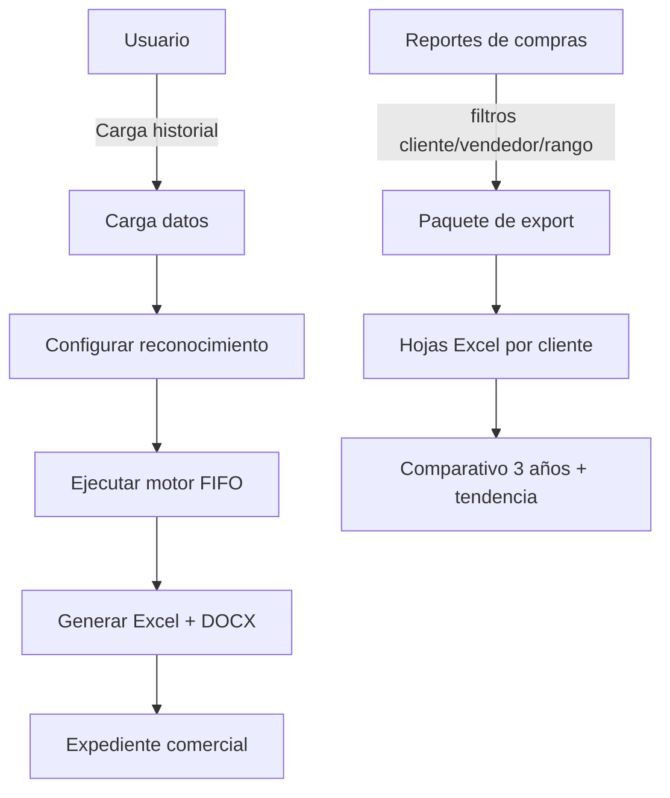

# G360 Sustento Multirreferencia 🚀

> Microherramienta avanzada del ecosistema G360 para la automatización de cuadros de sustento — Notas de Crédito (NC), Débito (NDB), Factura Directa —, reportes analíticos de compras y análisis de ventas CRM.

[](https://opensource.org/licenses/MIT)
[](https://github.com/carloscus/g360_NC_sustentor.git)
[](https://www.python.org/downloads/)
[]()


```mermaid
flowchart TD
    A[Usuario] -->|Carga historial| B[Carga datos]
    B --> C[Configurar reconocimiento]
    C --> D[Ejecutar motor FIFO]
    D --> E[Generar Excel + DOCX]
    E --> F[Expediente comercial]

    A2[Reportes de compras] -->|filtros cliente/vendedor/rango| B2[Paquete de export]
    B2 --> C2[Hojas Excel por cliente]
    C2 --> D2[Comparativo 3 años + tendencia]
```

## Tabla de Contenidos

- [Características](#características)
- [Instalación](#instalación)
- [Uso Básico](#uso-básico)
- [Reportes de Compras](#reportes-de-compras)
- [Base de Datos Local y Cartuchos](#base-de-datos-local-y-cartuchos)
- [Reportes Disponibles](#reportes-disponibles)
- [Diccionario de Datos](#diccionario-de-datos)
- [Decisiones de Diseño Importantes](#decisiones-de-diseño-importantes)
- [Estructura del Proyecto](#estructura-del-proyecto)
- [Desarrollo](#desarrollo)
- [Documentación Adicional](#documentación-adicional)
- [Contribución](#contribución)
- [Soporte](#soporte)
- [Versionado](#versionado)
- [Licencia](#licencia)

---

## 🚀 Características

### 🧠 Tipos de Reconocimiento
- **Diferencia de Precio**: Compara precio facturado vs. lista de precios vigente.
- **Omisión de Descuentos**: Aplica cadena de descuentos autorizada.
- **Bonificación 12+1**: Calcula unidades bonificadas por mecánica promocional.
- **Rebate por Meta**: Aplica % de rebate sobre compras acumuladas en período.
- **Anulación de Factura**: Reporte con columnas editables (P.BASE, DESC_1, DESC_2) y fórmulas vivas.
- **Feria / Preventa**: Cruce entre solicitud y facturación real.
- **Sustento por Factura**: Verificación de precios contra condición comercial.
- **Descuento en Factura**: % global o por SKU con archivo de filtro.

### 📊 Reportes Generados
- **Excel (NC)**: Cabecera + detalle de SKU con fórmulas, alertas y validaciones.
- **DOCX (Informe)**: Informe de sustento comercial programático con header/footer profesional.
- **Libro de compras (XLSX)**: Un libro por cliente con hasta 7 hojas, filtros como Tablas de Excel y `SUBTOTAL` que respeta el filtrado. Ver [Reportes de Compras](#reportes-de-compras).
- **Plantillas**: 5 listas de insumo con convención única — `Lista_de_Precios`, `Lista_de_Precios_y_Cantidades`, `Lista_de_Descuentos`, `Lista_de_Descuentos_y_Cantidades`, `Lista_de_Devoluciones` (más la base `Historial_de_Ventas`).

### Validación de Datos
- **Detección de NC/NDB**: Identifica notas existentes en el historial para evitar sobre-sustentar.
- **Validación de campos críticos**: ID_ARTICULO, NOM_ARTICULO, FECHA_ORIG, CANTIDAD, SOLES, TPO_DOC, SERIE_DOC, NRO_DOC.
- **Normalización**: Limpieza y estandarización de datos ERP.

---

## 📦 Instalación

### Requisitos
- Python 3.11+

### Instalación
```bash
# Sincronizar dependencias con UV
uv sync

# Ejecutar
python main.py
```

---

## 🎯 Uso Básico

### 1. Cargar Datos
1. Click en "ARCHIVOS" → cargar Historial (Excel)
2. Cargar Lista de Precios y/o Requerimientos según el tipo

### 2. Configurar Reconocimiento
1. Seleccionar tipo de operación en "CONFIGURACIÓN"
2. Elegir Vendedor (opcional), Cliente y Factura
3. Configurar parámetros específicos (% descuento, mecánica, etc.)

### 3. Ejecutar y Generar
1. Click en "EJECUTAR RECONOCIMIENTO"
2. Revisar resultados y alertas
3. Click en "GENERAR EXPEDIENTE" para obtener Excel + DOCX

---

## 📊 Reportes de Compras

Card colapsable **Reportes** (`src/ui/reporte_panel.py`), independiente del
flujo de reconocimiento: lee de la DB local y no toca el historial en memoria.
Filtra por **vendedor**, **cliente** (multi-selección) y **rango**, y escribe
**un libro `.xlsx` por cliente** en el Escritorio.

### Hojas del paquete

| Hoja | Chip | Contenido |
|------|------|-----------|
| `Resumen Ejecutivo` | (forced) | Portada: RUC, vendedor, alcance, índice con hipervínculos |
| `Consolidado` | Consolidado | Ventas por línea y por SKU del rango |
| `Comparativo` | Comparativo | 3 años, grano mes × línea × SKU |
| `Ajustes_NC_NDB` | Ajustes NC/NDB | Notas existentes y huérfanas |
| `BD_Registro` | BD Registro | Una fila por documento con analíticas |
| `Facturas` | Facturas | Detalle por factura (bloque F/B) |
| `Sucursales` + `Sucursal_Linea_Mes` + `Sucursal_SKU_Mes` | Sucursales · Pareto + mes×línea/SKU | Pareto del rango y desglose mensual |

La portada se fuerza siempre que haya histórico y corte. `Sucursales` viene
**desactivada por defecto** (es un análisis especializado y pesa). Un fetch
fallido omite su hoja sin tirar el paquete completo.

### Comparativo: grano y ventana

- **Grano**: una fila por `(mes, código línea, código SKU)`. El mes se compara
  contra **el mismo mes del año anterior**, no contra la fila vecina.
- **Ventana**: siempre los últimos 3 años calendario — 2 años completos y el
  actual hasta `corte_hasta` — independientemente del rango elegido. El rango
  solo define qué meses cuentan para `TOTAL DEL RANGO`.
- **Columnas**: `Mes · Código línea · Línea · Código SKU · SKU` +
  `Unid`/`Soles` por año + `dif`/`%` contra el año previo + `Obs.` +
  `Tend. Soles` + `Tend. Precio`.
- **Totales**: `TOTAL COMPARABLE` (intersección de meses entre años, con `dif`
  válido) y `TOTAL DEL RANGO` (meses del periodo por año). El primero usa
  fórmulas `SUBTOTAL`; el segundo se calcula en Python y se escribe como valor
  estático, porque una sola fórmula para los meses del rango superaba el
  límite de 8192 caracteres de Excel.

### Los dos indicadores de tendencia

Como `Soles = volumen × precio`, la facturación y el **precio promedio
unitario** (`Soles/Unidades`) son ejes independientes; leerlos juntos explica
de dónde sale el movimiento. Ambos comparan el mismo par de años (los dos más
recientes con dato) y usan las mismas bandas: `↑` > +5 %, `↓` < −5 %, `→`
estable, vacío si no hay base comparable.

| Lectura | Significado comercial |
|---|---|
| Soles ↑ · Precio → | Crecimiento por volumen, sin tocar el precio |
| Soles ↑ · Precio ↑ | Crecimiento con mejora de precio |
| Soles ↑ · Precio ↓ | **Crecimiento comprado con descuento** |
| Soles ↓ · Precio → | Caída de volumen a precio estable |
| Soles ↓ · Precio ↓ | Caída real de precio |
| Soles → · Precio ↓ | Volumen y precio se compensan |

Se descartó la variación de unidades como indicador propio: su flecha resultó
redundante con la de Soles (0 de 263 filas comparables divergían), mientras
que el precio discrepa en el 24 %.

### Allowlist y banderas

Los reportes **muestran todas las líneas** de la DB local
(`solo_lineas_activas=False`): el análisis no debe depender de una lista
configurada a mano. Las líneas fuera del allowlist no se ocultan, se marcan en
`Obs.` junto con los otros dos casos:

| Bandera | Significado |
|---|---|
| `Fuera del allowlist` | La línea no está en la lista validada |
| `Línea genérica` | Código de línea `99` |
| `SKU en 2+ líneas` | El mismo SKU aparece bajo 2+ líneas en el mes, y por eso se partió en filas separadas |

---

## 💾 Base de Datos Local y Cartuchos

### Archivos (`%APPDATA%/g360-erp-nc-sustentor/data/`)

| Archivo | Qué es |
|---|---|
| `historial.db` | DB de trabajo: 2,8M filas, 14 tablas con forma **idéntica a la canónica** (`g360-db-ventas`) |
| `estado_sustentor.db` | Sidecar: decisiones O/C (`oc_alias`) + watermark de captura (`day_state`). Viaja en el cartucho |
| `config.json` | Credenciales intranet + líneas + UI. **Nunca viaja** (se queda en cada PC) |
| `export/cartucho-<ts>.zip` | Cartucho listo para llevar (~430 MB) |
| `backup/` | Backups automáticos + manuales. `raw/` son los exports crudos (fuente offline de O/C) |

### Contrato de forma

`historial.db` cumple tablas + columnas + orden exactos de la canónica (`user_version = 3`). `verificar_contrato()` lo comprueba; `init_db()` construye lo faltante pero **bloquea** (`ContratoDBError`) ante forma distinta en vez de mutar en silencio. Índices, vistas y cachés (`agg_cliente_mes`, `nc_asociadas`) son artefactos locales y se reconstruyen al abrir.

### Actualizar hoy (incremental)

Toma `MAX(fecha_orig)`, vuelve 7 días (overlap por tardíos) y planifica: brecha ≤ 22 días → todo diario; si no, meses viejos en bulk + cola diaria. Cada chunk borra-recarga **su día** en una transacción (idempotente: 3 corridas convergen). Si una descarga trae <50% de lo guardado se aborta el chunk (queda fallido) en vez de achicar el día. `mes_ref` siempre mensual; el allowlist de líneas es **filtro de pantalla, no de guardado** (todas las PCs guardan el espejo completo).

### Órdenes de compra

El valor normalizado vive en `ord_compra` (columna canónica). El mapeo crudo→canónico y las revisiones manuales viven en `oc_alias` (sidecar). Sin revisión no se fusiona: queda `pendiente`. Las pendientes se revisan en Configuración DB → pestaña **Campos** (botones Confirmar/Separar).

### Campos críticos del sustentor

O/C, sucursal, división, vencimiento y condición de pago **ya vienen** en cada captura (el CSV de intranet trae columnas fijas y se guarda espejo completo: no hay nada que "traer"). El problema histórico fue que nadie sabía que existían — igual que pasó con las O/C — porque filtrar por ellos era un escaneo completo (división = 26 s). Por eso:

| Campo | Cobertura típica | Índice |
|---|---|---|
| `ord_compra` | ~57% (no todo documento lleva OC) | `idx_venta_oc` |
| `cod_sucursal` / `nom_sucursal` | ~59% / 100% | `idx_venta_sucursal` / — (a demanda) |
| `division` | ~97% | `idx_venta_division` |
| `fecha_venc` | 100% | `idx_venta_venc` |
| `nom_condicion_pago` | 100% | `idx_venta_condicion` |

- `auditar_campos_criticos()` mide cobertura e índice por campo (veredicto `ok` / `sin_indice` / `degradado` / `perdido`). Se ve en Configuración DB → pestaña **Campos**, con botón **Contrastar con origen** (coteja cobertura por columna contra la fuente, últimos 90 días): si una captura deja de traer un campo, grita ahí en vez de leerse como "no hay datos".
- `fetch_historial()` acepta `divisiones`, `condiciones_pago`, `sucursales`, `fecha_venc_desde/hasta` (todos `None` = sin filtrar). Habilitados para llamar cuando haga falta; la UI de filtros todavía no existe.

### Tiendas (preparación versión supermercados)

La tienda real es el par **(cliente, sucursal)**: el código solo se repite entre clientes (`01` = 3.268 clientes). `nom_sucursal` tiene 6.752 variantes globales pero el nombre por par es estable (7.530 pares, 1 ambiguo).

- `distinct_sucursales()`: catálogo con nombre por moda del par, ubigeo, distrito, filas, soles y rango de meses (con caché, como líneas).
- `categoria_sucursal()`: `sucursal` (con código) · `principal` (`ACUMULADO` de un cliente con otras tiendas: es su matriz) · `unica` (cliente sin más datos) · `sin_dato`. El 41.5% `ACUMULADO` **no se descarta**: LINDA 28.8% y CONTINENTAL 23.6% de su venta están ahí.
- `fetch_historial()` también filtra por `sucursal_cliente=[(cliente, cod)]` (usa `idx_venta_cliente_sucursal`), `nombres_sucursal`, `id_ubigeos` y `distritos`.
- `distribucion_por_tienda(cliente, desde, hasta)`: soles y % por tienda con su categoría. El % se calcula dentro del rango (las tiendas abren/cierran: TOTTUS 136, SPSA 207).
- En **Reportes de compras**, el chip opcional **Sucursales · Pareto + mes** añade al libro de cada cliente tres hojas planas: `Sucursales` (Pareto del rango), `Sucursal_Linea_Mes` y `Sucursal_SKU_Mes`. La línea/SKU se agrupa por mes; no se genera vista semanal.
- El Pareto se ordena por venta bruta y muestra devoluciones/descuentos/NDB, neto, unidades y participación acumulada. Las hojas mensuales conservan ambos códigos y descripciones sin duplicar encabezados; encabezados en fila 1 y Tablas de Excel con filtros. Muestran **todas** las líneas presentes en la DB local (`solo_lineas_activas=False`) para que el análisis no dependa del allowlist; el switch NC/ND y el rango sí se respetan.
- Se exporta un libro independiente por cada cliente seleccionado. Las tres hojas de sucursal se activan juntas con el chip opcional; los reportes estándar siguen sin generarlas.

### Cartucho (transporte entre PCs)

Un `.zip` con `historial.db` + `estado_sustentor.db` + `config_sanitizado.json` (solo allowlist, **sin llaves**) + `CARTUCHO.json` (manifiesto: procedencia, rango, `sha256`, conteos). Dos tipos: `trabajo` (con decisiones) y `semilla` (DB recién salida de la canónica, sin sidecar).

- **Exportar**: Compartir → Exportar cartucho (checkpoint + valida contrato e integridad antes de empaquetar).
- **Importar**: Gestión → Importar cartucho (acepta `.zip`, carpeta, `CARTUCHO.json` o `historial.db` suelto). Valida manifiesto + `sha256` + contrato, decide **reemplazo** (superset por día) o **merge por folio**, siempre con backup previo. El sidecar se **une** (nunca se pisa); conflictos O/C → gana el entrante y queda en el log.
- **Adoptar líneas**: trae el allowlist del cartucho como referencia; un botón lo aplica localmente con confirmación (la config de cada PC no se pisa sola).

### Reglas operativas

1. App cerrada antes de copiar archivos a mano (el `-wal` queda afuera si no).
2. USB en exFAT/NTFS (FAT32 tiene techo de 4 GB; el zip hoy pesa ~430 MB y entra hasta en CD-R).
3. Una sola PC resuelve colisiones O/C a mano, en la pestaña Campos (evita conflictos entre PCs).
4. La PC más al día exporta periódicamente; el manifiesto muestra `fecha_max` sin abrir nada.
5. Credenciales y llaves no viajan nunca (ni en el cartucho ni en copias manuales de `config.json`).

---

## 📊 Reportes Disponibles

### Tipos de Reconocimiento

| Tipo | Descripción | Modo | Archivos Generados |
|------|-------------|------|-------------------|
| **Diferencia de Precio** | Compara precio facturado vs. lista vigente | Por factura | 1 XLSX + 1 DOCX por factura |
| **Descuento por Precio** | % global o por SKU con archivo de filtro | Consolidado | 1 XLSX + 1 DOCX |
| **Descuento por Factura** | Descuento por línea con archivo de filtro | Consolidado | 1 XLSX + 1 DOCX |
| **Sustento por Factura** | Verificación contra condición comercial | Consolidado | 1 XLSX + 1 DOCX |
| **Diferencia de Stock** | Stock fakturado vs. stock actual | Consolidado | 1 XLSX + 1 DOCX |
| **Feria / Preventa** | Cruce solicitud vs. facturación | Consolidado | 1 XLSX + 1 DOCX |
| **Anulación de Factura** | Reporte con columnas editables | Consolidado | 1 XLSX + 1 DOCX |
| **Bonificación 12+1** | Unidades bonificadas por mecánica | Consolidado | 1 XLSX + 1 DOCX |

### Columnas por Tipo

#### Diferencia de Precio (dual-table)

**Tabla 1: COMO SE ATENDIÓ**
| Columna | Fuente | Formato |
|---------|--------|---------|
| N° | Índice | - |
| FACTURA | Calculado | Texto |
| SKU | ERP | Texto |
| ARTICULO | ERP | Texto |
| CANTIDAD | ERP | `#,##0` |
| PRECIO UNID. | SOLES / CANTIDAD | `#,##0.00000` |
| TOTAL FACTURA | Fórmula | `S/ #,##0.00` |

**Tabla 2: LISTA DE PRECIOS**
| Columna | Fuente | Formato |
|---------|--------|---------|
| N° | Índice | - |
| FACTURA | Calculado | Texto |
| SKU | ERP | Texto |
| ARTICULO | ERP | Texto |
| CANTIDAD | ERP | `#,##0` |
| PRECIO LISTA | Lista de precios | `#,##0.00000` |
| PRECIO NETO | Fórmula (4 descuentos) | `#,##0.00000` |
| DIF. UNITARIA | MAX(0, ROUND(HIST - NETO, 5)) | `#,##0.00000` |
| MONTO NC | Fórmula (DIF × CANT) | `S/ #,##0.00` |
| NC/NDB EXISTENTE | Detector | Texto |
| ALERTA | Motor de alertas | Texto |

### Reportes Consolidados

| Tipo | Descripción | Agrupación |
|------|-------------|------------|
| **Por SKU** | Análisis de ventas por artículo | SKU → LÍNEA → CLIENTE |
| **Por Línea** | Análisis de ventas por línea de producto | LÍNEA → SKU → CLIENTE |
| **Por Cliente** | Análisis de ventas por cliente | CLIENTE → LÍNEA → SKU |
| **Por Mes** | Análisis de ventas por período | PERIODO → SKU → LÍNEA → CLIENTE |
| **Por Factura** | Análisis detallado por documento | FACTURA → SKU |
| **Pareto Cliente** | Análisis 80/20 de clientes | CLIENTE (columnas por LÍNEA) |
| **Comparativo** | Compara el mismo mes (× línea × SKU) contra los años previos | SKU/LÍNEA/MES (columnas por AÑO) |

### Campos en Reportes

#### Comunes a Todos
- `N°`: Número de fila
- `CANTIDAD`: Cantidad total
- `MONTO`: Monto total en soles
- `FECHA ULT.`: Fecha más reciente
- `FACTURAS`: Lista de documentos
- `PRECIOS`: Lista de precios

#### Específicos
- **Por SKU**: SKU, LÍNEA, CLIENTE
- **Por Línea**: LÍNEA, SKU, CLIENTE
- **Por Cliente**: CLIENTE, LÍNEA, SKU
- **Por Mes**: PERIODO, SKU, LÍNEA, CLIENTE
- **Por Factura**: FACTURA, FECHA, CLIENTE, LÍNEA, SKU, CANTIDAD, PRECIO, MONTO
- **Pareto Cliente**: CLIENTE, TOTAL, %, CAT, [L01-CANT, L01-MONTO, L01-%], [L02-CANT, L02-MONTO, L02-%], ...
- **Comparativo**: MES, CÓDIGO LÍNEA, LÍNEA, CÓDIGO SKU, SKU, [Unid/Soles por AÑO], [dif/% contra el año previo], OBS., TEND. SOLES, TEND. PRECIO

---

## 📚 Diccionario de Datos

### Campos Compuestos

| Campo | ID | Nombre | Formato | Uso |
|-------|----|-------|---------|-----|
| **SKU** | `ID_ARTICULO` | `NOM_ARTICULO` | "ID - NOMBRE" |
| **LÍNEA** | `ID_LINEA` | `NOM_LINEA` | "ID - NOMBRE" |
| **CLIENTE** | `ID_CLIENTE` | `NOM_CLIENTE` | "ID - NOMBRE" |
| **VENDEDOR** | `ID_VENDEDOR` | `NOM_VENDEDOR` | "ID - NOMBRE" |
| **SUCURSAL** | `COD_SUCURSAL` | `NOM_SUCURSAL` | "ID - NOMBRE" |

### Campos de Documento

| Campo | Formato | Ejemplo |
|-------|---------|---------|
| **FACTURA** | "TIPO + SERIE - NUMERO" | "F012-0457996" |
| **PEDIDO** | "ID_PEDIDO" | "12345" |

### Campos de Lista

| Campo | Singular | Descripción |
|-------|----------|-------------|
| **CLIENTES** | CLIENTE | Lista de clientes |
| **FACTURAS** | FACTURA | Lista de facturas |

### Valores a Filtrar

Los siguientes valores son filtrados automáticamente:
- `SIN ASIGNAR`
- `''` (vacío)
- `nan`
- `None`

---

## ⚠️ Decisiones de Diseño Importantes

### 0. Precisión y Formato de Valores Monetarios

**Estándar SUNAT (UBL 2.1):**
- **Precios unitarios**: hasta 10 decimales (usamos 5)
- **Cantidades**: hasta 10 decimales (usamos 6)
- **Totales (Subtotal, IGV, Total)**: exactamente 2 decimales

**Reglas de Redondeo:**

| Campo | Decimales | Ejemplo |
|-------|-----------|---------|
| PRECIO LISTA | 5 | `#,##0.00000` → 21.50000 |
| PRECIO NETO | 5 | `#,##0.00000` → 15.17040 |
| DIF. UNITARIA | 5 | `#,##0.00000` → 0.30960 |
| MONTO NC | 2 | `S/ #,##0.00` → S/ 3.10 |
| Subtotal / IGV / Total | 2 | `S/ #,##0.00` → S/ 10.85 |

**Filtrado de Negativos por Redondeo:**
- DIF. UNITARIA usa `MAX(0, ROUND(PRECIO_HIST - PRECIO_NETO, 5))`
- Esto evita diferencias negativas causadas por precisión de punto flotante
- Ejemplo: `0.93175 - 0.93180 = -0.00005` → `MAX(0, -0.00005) = 0.00000`

**Consistencia de Subtotales:**
- El subtotal del Excel y del DOCX se calcula sumando valores redondeados por fila
- No se redondea la suma total, sino cada fila individualmente
- Ejemplo: `1.55 + 3.10 + 3.10 + 3.10 = 10.85` (no `round(10.836) = 10.84`)

**Formato de Moneda:**
- Subtotales en Excel: `"S/" #,##0.00` (muestra "S/ 10.85")
- Columnas de la tabla: `#,##0.00` (sin prefijo, para legibilidad)
- DOCX: `S/ {valor:,.2f}` (muestra "S/ 10.85")

---

### 1. Formato estándar de campos compuestos

**Estándar:**
- Todos los campos compuestos usan formato "ID - NOMBRE" (ej: `"12345 - Producto A"`, `"0101 - ARCHIVO"`)
- Ver `DataDictionary.format_composite_field` en `src/core/data_dictionary.py`

---

## 🔧 Estructura del Proyecto

```
g360-erp-nc-sustentor/
├── src/
│   ├── core/
│   │   ├── data_dictionary.py    # Diccionario centralizado de campos
│   │   ├── detector.py           # Detección de NC/NDB existentes
│   │   ├── g360_theme.py         # Tema visual + decorador @safe_handler
│   │   ├── inventory.py          # Lógica de inventario (pandas puro)
│   │   ├── utils.py              # Utilidades (format_id_name, etc.)
│   │   ├── doc_matcher.py        # Coincidencia de documentos
│   │   ├── nc_auditor.py         # Auditor de notas de crédito
│   │   ├── nc_reconciliation.py  # Conciliación NC ↔ facturas
│   │   ├── document_classifier.py# Clasificación del tipo de operación
│   │   ├── capture_service.py    # Captura de intranet + credenciales
│   │   ├── intranet_client.py    # Cliente HTTP de intranet
│   │   ├── ventas_db.py          # Esquema SQLite canónico + init_db()
│   │   ├── ventas_db_client.py   # Lecturas read-only del SQLite (DataFrames)
│   │   ├── ventas_db_config.py   # Allowlist de líneas, anclajes, config
│   │   ├── ventas_db_backup.py   # Backup / export de la DB
│   │   ├── cartucho.py           # Cartucho .zip entre PCs (con manifiesto)
│   │   ├── db_network.py         # Topología de DBs en red
│   │   ├── delta_replay.py       # Replay incremental (Actualizar hoy)
│   │   ├── oc_backfill.py        # Relleno de ord_compra
│   │   ├── xls_processor.py      # Lectura del historial .xlsx
│   │   └── models.py             # Modelos de dominio
│   ├── strategies/               # Un módulo por tipo de reconocimiento
│   │   ├── price_difference.py   # Diferencia de Precio
│   │   ├── price_discount.py     # Descuento en Factura
│   │   ├── promotion_bonus.py    # Bonificación 12+1
│   │   ├── volume_rebate.py      # Rebate por meta
│   │   ├── cancel_invoice.py     # Anulación de Factura
│   │   ├── feria_preventa.py     # Feria / Preventa
│   │   ├── descuento_factura.py  # Descuento por SKU
│   │   ├── cantidad_determinada.py
│   │   ├── devolucion_fisica.py
│   │   └── allocation/
│   │       └── engine.py         # Motor de asignación FIFO
│   ├── render/
│   │   ├── excel_renderer.py     # Render de Excel (NC sustento)
│   │   ├── excel_render_calculo.py
│   │   ├── audit_renderer.py     # Render del Excel de auditoría
│   │   ├── docx_renderer.py      # Render de DOCX (informe)
│   │   ├── g360_styles.py        # Estilos compartidos Excel/DOCX
│   │   └── templates.py          # Generación de plantillas
│   ├── validation/
│   │   ├── engine.py             # Motor de validación
│   │   └── normalization.py      # Normalización de datos ERP
│   ├── api/
│   │   └── supabase_endpoint.py  # API REST de historial
│   ├── ui/
│   │   ├── reconocimiento_view.py # Vista principal de Reconocimiento
│   │   ├── view_panels.py        # Paneles (incluye Config DB → Campos)
│   │   ├── view_handlers.py      # Handlers de la vista
│   │   ├── view_helpers.py       # Helpers de UI
│   │   ├── resultados_view.py    # Resultados y alertas
│   │   ├── reporte_panel.py      # Card de reportes de compras (filtros)
│   │   ├── reporte_compras.py    # Construcción del libro XLSX
│   │   ├── expediente_service.py # Expedientes EXP-*
│   │   ├── catalog.py            # Catálogo de casos
│   │   ├── template_dialog.py    # Modal de plantillas
│   │   ├── config_builder.py     # Construcción de config
│   │   ├── reconocimiento_config.py
│   │   └── widgets/              # Selectores y controles reutilizables
│   ├── pipeline.py               # Orquestador de pipelines
│   └── domain.py                 # Modelos de dominio
├── g360/ui/signature.py          # Widget G360Signature
├── assets/
│   ├── templates/                # Plantillas Excel canónicas
│   └── snippets/                 # Snippets de código
├── catalog/                      # Casos de uso declarados
├── docs/
│   └── ventas-db-integration.md  # Contrato de la DB de ventas
├── tests/                        # Suite unitaria (1123 tests)
├── main.py                       # Aplicación principal
├── pyproject.toml                # Configuración del proyecto (uv)
└── README.md
```

---

## 🛠️ Desarrollo

### Ejecutar Tests
```bash
python -m pytest tests/
```

### Validar Historial
```python
from src.validation.normalization import NormalizationEngine
from src.validation.engine import ValidationEngine

# Normalizar historial del ERP
df_norm = NormalizationEngine().normalizar_historial(df_historial)

# Validar y obtener lista de observaciones
observaciones = ValidationEngine().validar(df_norm)
```

### Usar el Diccionario de Datos
```python
from src.core.data_dictionary import DataDictionary

# Formatear campos compuestos
sku = DataDictionary.format_composite_field("SKU", "12345", "Producto A")
# Resultado: '12345 - Producto A'

linea = DataDictionary.format_composite_field("LÍNEA", "0101", "ARCHIVO")
# Resultado: '0101 - ARCHIVO'

cliente = DataDictionary.format_composite_field("CLIENTE", "C001", "Cliente X")
# Resultado: 'C001 - Cliente X'

# Filtrar DataFrames
df_filtrado = DataDictionary.filter_dataframe(df, "NOM_CLIENTE")
df_filtrado = DataDictionary.filter_dataframe(df, "NOM_VENDEDOR")

# Validar campos
result = DataDictionary.validate_composite_field("SKU", "12345", "Producto A")
if not result["valid"]:
    print("Errores:", result["errores"])
```

---

## 📝 Documentación Adicional

- **[docs/ventas-db-integration.md](docs/ventas-db-integration.md)** — Contrato de la DB de ventas: esquema canónico, `mes_ref`, allowlist y sincronización incremental.

Los análisis y resúmenes de diseño que vivían en la raíz del repositorio se
retiraron al consolidarse en el código y en los tests que los fijan.

---

## 🤝 Contribución

### Reglas de Código

1. **Mantener consistencia** en el uso de campos compuestos
2. **No cambiar** los diseños de Pareto y NC sin justificación clara
3. **Documentar** cualquier cambio en el diccionario de datos
4. **Validar** el historial antes de procesar
5. **Usar** el diccionario de datos para formatear campos compuestos

### Proceso de Cambios

1. **Analizar** el impacto del cambio propuesto
2. **Documentar** la justificación del cambio
3. **Actualizar** el diccionario de datos si es necesario
4. **Actualizar** el código para usar el nuevo formato
5. **Validar** que todos los reportes usen el formato correcto
6. **Probar** que los reportes se generen correctamente

### Pull Requests

Antes de enviar un PR, asegúrate de:
1. Actualizar la documentación relevante
2. Validar que los cambios no rompan la compatibilidad
3. Probar que todos los reportes funcionan correctamente
4. Actualizar las pruebas si es necesario

---

## 📞 Soporte

### Problemas Comunes

**Error: "No se hallaron datos válidos en el archivo"**
- Verifique que el archivo tenga las columnas críticas: ID_ARTICULO, NOM_ARTICULO, FECHA_ORIG, CANTIDAD, SOLES, TPO_DOC, SERIE_DOC, NRO_DOC

**Error: "No hay datos para Pareto"**
- Verifique que haya clientes en el historial
- Verifique que haya líneas en el historial
- Verifique que los filtros no estén excluyendo todos los datos

**Error: "El sistema no puede encontrar el archivo especificado"**
- Verifique que la ruta del archivo sea correcta
- Verifique que tenga permisos para escribir en el directorio de destino

---

## 🎯 Objetivo del Proyecto

G360 Sustento Multirreferencia es una herramienta de **análisis y generación de sustento comercial** con las siguientes características:

1. **Automatización**: Procesa automáticamente requerimientos de NC y asigna facturas de sustento
2. **Validación**: Verifica la consistencia de datos antes de procesar
3. **Análisis**: Proporciona reportes consolidados para análisis de ventas
4. **Pareto**: Genera análisis 80/20 de clientes por vendedor
5. **Comparativo**: Compara el mismo mes entre 3 años, con tendencia de facturación y de precio
6. **Calidad de Datos**: Valida y mejora la calidad de los datos del historial

---

## 🔍 Exploración de Casos de Uso

Esta herramienta no se limita solo a Notas de Crédito. El motor FIFO inverso, el detector de NC/NDB, y el generador de informes pueden aplicarse a múltiples escenarios comerciales y operativos.

### Cómo descubrir nuevos casos

1. **Analizar el historial**: Consulte la DB local para identificar patrones:
   ```python
   from src.core.ventas_db_client import VentasDbClient

   cli = VentasDbClient()
   df = cli.fetch_historial(id_cliente="00068414")

   # Listar tipos de documento únicos
   print(df["TPO_DOC"].unique())

   # Ver operaciones por tipo
   print(df.groupby("TPO_DOC").agg(docs=("NRO_DOC", "count"), total=("SOLES", "sum")))
   ```

   `fetch_historial()` acepta además `id_articulo`, `mes_ref`, `serie_doc`,
   `divisiones`, `condiciones_pago`, `sucursales`, `sucursal_cliente`,
   `nombres_sucursal`, `id_ubigeos`, `distritos` y `fecha_venc_desde/hasta`
   (todos `None` = sin filtrar).

2. **Detectar NC/NDB existentes**: Use el módulo detector para facturas que ya tienen ajustes:
   ```python
   from src.core.detector import (
       detectar_notas_en_historial,
       resumen_notas_por_factura,
       separar_inventario,
   )

   notas = detectar_notas_en_historial(df)
   resumen = resumen_notas_por_factura(notas)
   for factura, info in resumen.items():
       print(f"{factura}: {info['total_notas']} nota(s), S/ {info['total_soles']:.2f}")
   ```

3. **Identificar situaciones atípicas**:
   - Facturas con precio cero o negativo
   - Documentos sin referencia (REFERENCIA vacía)
   - SKUs con cantidad negativa (devoluciones sin NC)
   - Períodos sin movimiento seguido de picos
   - Clientes con alta concentración en una línea

4. **Documentar el caso**: Cree un archivo `CASO_<nombre>.md` en la raíz del proyecto con:
   - Descripción del escenario
   - Query usada para detectarlo
   - Columnas relevantes del historial
   - Resultado esperado vs real
   - Si aplica, template DOCX asociado

### Casos conocidos

| Caso | Módulo | Descripción |
|------|--------|-------------|
| **Sustento NC por Lote** | Multirreferencia | Carga masiva de SKUs de múltiples facturas, asigna documentos FIFO |
| **Diferencia de Costo** | Diferencia de Precio | Precio atendido vs lista vigente, en modalidad Individual (por factura) o Consolidado (por SKU) |
| **NC/NDB detectados** | Detector | Facturas que ya tienen Notas de Crédito o Débito aplicadas |
| **Ajuste por campaña** | Informe | Documento Word con detalle comercial y tipo de operación |
| **Análisis Pareto** | Consolidados | Clientes 80/20 por vendedor, líneas, SKU |
| **Comparativo interanual** | Reportes de compras | Mismo mes × línea × SKU contra 2 años previos, con tendencia de facturación y de precio |

### Templates disponibles

Se descargan desde la app (botón de plantillas) y su copia canónica vive en
`assets/templates/`. Convención de nombres:
`Lista_de_<Precios|Descuentos|Devoluciones>[_y_Cantidades]`
— una plantilla por archivo de insumo, y `_y_Cantidades` cuando el archivo trae
la cantidad a reconocer. Sin marca en los nombres.

| Formato | Casos | Insumo que llena | Propósito | Ubicación |
|---------|-------|-----------------|-----------|-----------|
| `Lista_de_Precios.xlsx` | DC | `lista_precios` | Precio de lista por SKU (las cantidades salen de las facturas) | `assets/templates/` |
| `Lista_de_Precios_y_Cantidades.xlsx` | VRS | `lista_precios`, `cantidad` | Precio de lista + cantidad a reconocer por SKU | `assets/templates/` |
| `Lista_de_Descuentos.xlsx` | DO | `porcentaje` | Descuento por SKU sobre el precio atendido | `assets/templates/` |
| `Lista_de_Descuentos_y_Cantidades.xlsx` | FPE (columnas compatibles con PROM/CMV) | `porcentaje`, `cantidad` | Cantidad a sustentar + descuento por SKU | `assets/templates/` |
| `Lista_de_Devoluciones.xlsx` | DF | `cantidad` | Unidades devueltas por SKU (se asignan LIFO a las facturas) | `assets/templates/` |
| `Historial_de_Ventas.xlsx` | todos | `historico` | Formato base del historial de ventas (ERP) | `assets/templates/` |
| `INFORME_DE_SUSTENTO_COMERCIAL.docx` | todos | — | Informe comercial personalizado (Word) | Definido por el usuario |

Notas de la convención:
- El SKU siempre es la columna `CODIGO_SKU` (formato texto, conserva ceros).
- Los descuentos van en **fracción** (`0.05` = 5 %) en celdas con formato `0.00%`.
- Las instrucciones van en la hoja `LEEME`, nunca en la hoja de datos (si no,
  el motor las lee como registros).
- Cada plantilla declara en su `LEEME` a qué casos e insumos sirve.
- El insumo `sku` no tiene archivo propio: es la columna `CODIGO_SKU` que todas
  las listas ya traen.

### Expedientes generados

Cada expediente es una carpeta en el Escritorio llamada
`EXP-[CASO]-[CLIENTE]-[SERIE]-[NUMERO]-[YYYYMMDD]` (fuente única:
`build_expediente_id` en `src/ui/catalog.py`):

```
EXP-DC-50561-F204-67721-20260910/
├── EXP-DC-50561-F204-67721-20260910_Informe.docx     # informe de sustento
├── EXP-DC-50561-F204-67721-20260910_Calculo.xlsx     # Excel del cálculo
├── EXP-DC-50561-F204-67721-20260910_Historico.xlsx   # respaldo del historial
└── EXP-DC-50561-F204-67721-20260910_CalculoND.xlsx   # solo si se genera nota de débito
```

- Sin correlativo ni código de modalidad: el documento del ERP (cliente + serie +
  número) ya identifica el expediente, así que **regenerar el mismo caso no crea
  duplicados**.
- Individual: un expediente por (cliente × factura). Consolidado: uno por cliente.

---

## 🔄 Versionado

La versión canónica es la de `pyproject.toml`. El historial de cambios vive en
el log de commits (`git log --oneline`), no en este archivo, para evitar que
se desincronice.

### Cambios del módulo de reportes de compras

- ✅ Libro por cliente con 7 hojas y `SUBTOTAL` que respeta el filtrado
- ✅ `Comparativo` reestructurado a grano `(mes, línea, SKU)` con años en columnas (antes una fila por año)
- ✅ `TOTAL COMPARABLE` (intersección de meses) y `TOTAL DEL RANGO` (meses del periodo), el segundo estático para no exceder el límite de fórmulas de Excel
- ✅ `dif` con guarda: un año previo vacío no se interpreta como cero
- ✅ Allowlist como bandera (`Obs.`) en vez de filtro, junto con `Línea genérica` y `SKU en 2+ líneas`
- ✅ Dos indicadores de tendencia: `Tend. Soles` (facturación) y `Tend. Precio` (precio promedio unitario). Se evaluó usar unidades como segundo indicador, pero su flecha era redundante con la de Soles
- ✅ Análisis de sucursales: Pareto + `mes × línea` + `mes × SKU`

---

## 🎓 Notas Importantes

### ⚠️ Advertencias

1. **No cambiar** el diseño de Pareto (solo ID de líneas como encabezados) sin justificación clara
2. **No cambiar** el diseño de NC (columna SKU adicional) sin justificación clara
3. **No modificar** el diccionario de datos sin actualizar la documentación
4. **No eliminar** las funciones de validación del historial
5. **No cambiar** el formato de campos compuestos sin actualizar todos los reportes
6. **No reintroducir** proyecciones YTD, pro-rating ni metas mensuales en el
   `Comparativo`: se evaluaron y se descartaron por ruido. La proyección lineal
   con pro-rating se reemplazó por los dos indicadores de tendencia.

### 📚 Recursos de Aprendizaje

- **[docs/ventas-db-integration.md](docs/ventas-db-integration.md)** — cómo está modelada la DB de ventas y qué garantiza su contrato
- **[g360-signature](https://github.com/carloscus/g360-signature)** — componente de branding del ecosistema

---

## Familia G360

Este proyecto forma parte de la familia de microherramientas **G360** para apoyo CRM y gestión de datos en escritorio, enfocadas en áreas como ventas, finanzas y logística.

### Herramientas Relacionadas

- **[g360-cli](https://github.com/carloscus/g360-cli)**: Bootstrap de proyectos G360
- **[g360-signature](https://github.com/carloscus/g360-signature)**: Web component de branding
- **[g360-order-xlsx](https://github.com/carloscus/g360-order-xlsx)**: Procesador de cotizaciones Excel
- **[g360-signature-creator](https://github.com/carloscus/g360-signature-creator)**: Generador de firmas corporativas

---

## 📄 Licencia

MIT License.

> Nota: el badge declara MIT, pero el repositorio aún no incluye el archivo
> `LICENSE` ni el campo `license` en `pyproject.toml`. Agregar ambos para que
> la declaración sea verificable.

---

**Marca**: G360
**Isotipo**: 3 puntos verticales paralelos (gris-verde-gris) + chevron `>`
**Autor**: Carlos Cusi
**Desarrollo**: Con asistencia de herramientas de código IA (Vibe Code)
**Powered by**: [g360-signature](https://github.com/carloscus/g360-signature)
